# Recipe Tweaks

Minecraft 1.21+ QoL data pack to selectively improve recipes

<!-- vim-markdown-toc GFM -->

* [Features](#features)
* [Download pre-built](#download-pre-built)
* [Building from source](#building-from-source)

<!-- vim-markdown-toc -->

## Features

> [!NOTE]
> By [building from source](#building-from-source) you are able to toggle them individually or add your own.

| Before | After |
| ------ | ----- |
|  | 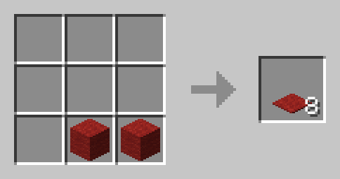 |
| 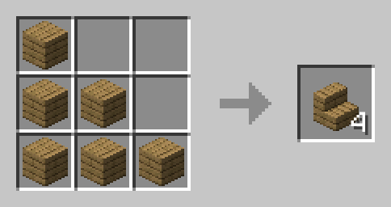 | 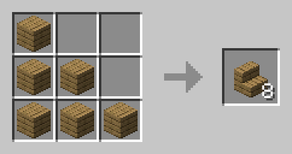 |
| | 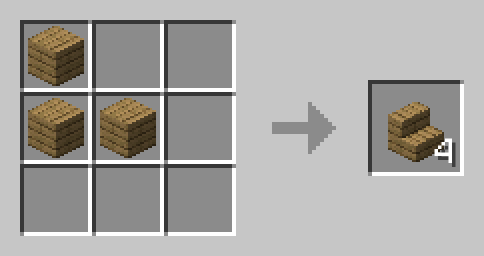 |
| 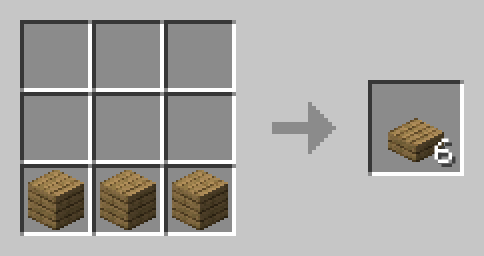 | 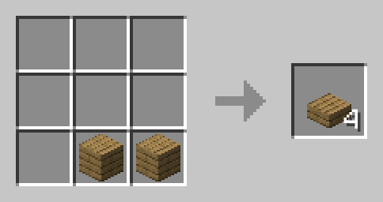 |
| 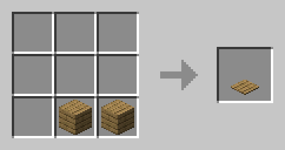 | 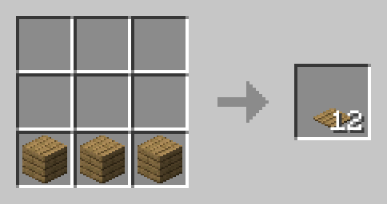 |
|  | 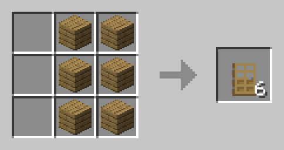 |
| 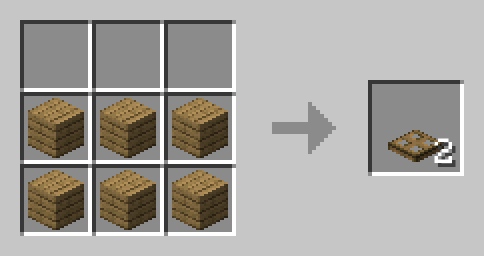 | 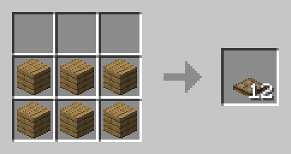 |

## Download pre-built

Navigate to [latest release](https://github.com/bbfh-dev/recipe-tweaks-datapack/releases/latest) and download the needed version.

## Building from source

> [!IMPORTANT]
> Requires `jq` and coreutils to be installed.

With all patches from `./src/patches/`:

```bash
cd ./src
./build.sh
```

If you want to build using only specific patches:

```bash
cd ./src
./build.sh 01_carpets.sh 06_trapdoors.sh # etc.
```
